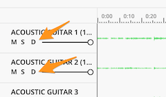

# Enhance backing track pages
keeps track of the loaded tracks for each song and add a "download" button, so can use the mp3 backing 
track standalone

## how it works
UG adds a div element on the page that carries all information about the necessary tracks for a specific backing track (song).

The user script picks up that info and adds a special div element with click handler to download that track using a 'mutation observer' for the dom tree.